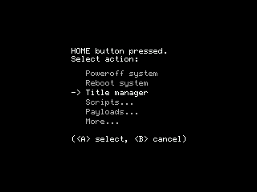

# Formatting a SD card using Godmode9

This guide will detail how to format you SD card to fat32 with Godmode9. You have to format your SD card to use it with your 3DS system and Godmode9 provides a quick and easy way to format your SD card.

## What do I need?

- An SD card
- A 3DS with GM9

## Getting started

1. Insert the new SD card into your 3DS
2. Hold `start` and power the system on
  - You will be brought to Godmode9
3. Press `home`

4. On this new screen, press `more`
5. Press `SD Format menu`
6. When prompted, select `No EmuNand`
7. Press `Auto`
8. Input whatever you would like to name the SD card. 
9. You will be asked to enter a key combo, enter it in
