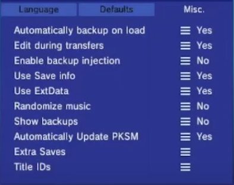

# Using PKSM with generation 3 VC injects

PKSM is a very powerful tool that allows you to edit saves for generations 1-8. Ordinarily PKSM only detects cartridge and digital games seemingly making it impossible to use with the VC injects or any generation 3 games. However, PKSM has a feature that allows you to do this, and this guide will detail it.

## What do I need?

- [PKSM](https://github.com/FlagBrew/PKSM/releases/10.0.0/)
- A generation 3 VC injection

## Checking the game ID

You will need to know the title ID of your injection. We will see how to do this here.

1. Open FBI
2. Click `titles`
3. All of your games will load in. Navigate to your VC injection
4. The game ID will be displayed on the screen. Keep note of it

## Registering the save

Here, you will register your save file so that it normally shows up with all of your other games in PKSM.

1. Open PKSM
2. Press `Y` you will be brought to a screen that looks like this

3. Tap on `Title IDs` you will be brought to a screen that looks like this

4. Select the icon for whatever game you're editing
5. Once you've done that, a keyboard will popup. Input the title ID that you got earlier in here
6. Press `Y` and your game should be there! 

## Troubleshooting

Issue: Even when I register it, it's still not showing up
Answer: You need to have played the game and saved
Issue: Title ID not found
Answer: You entered the incorrect title id
