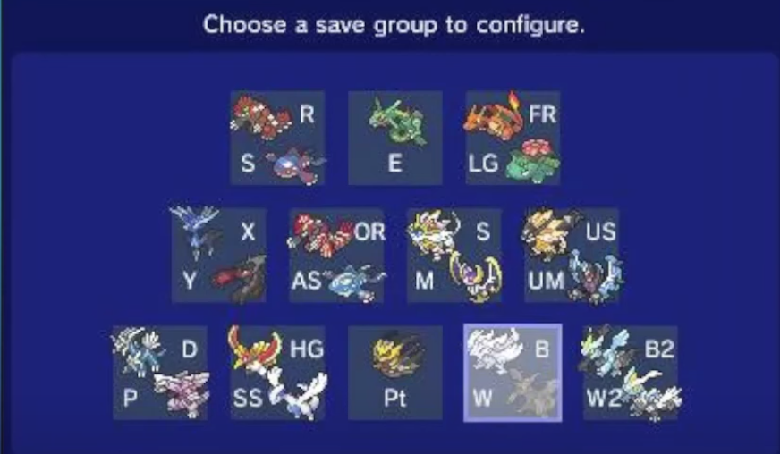
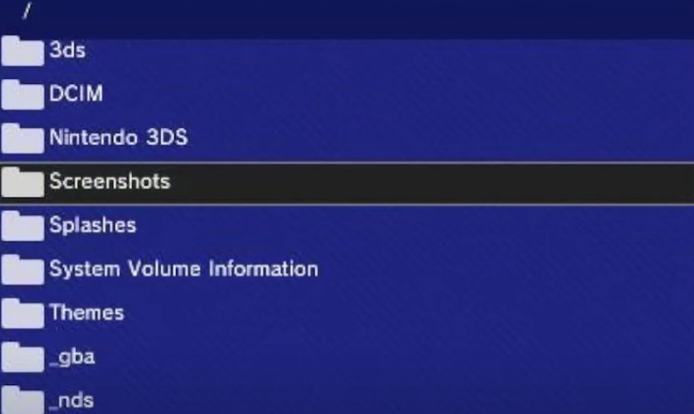

# PKSM + Twilight menu

PKSM is a very powerful tool that allows you to edit saves for generations 1-8. Ordinarily PKSM only detects cartridge and digital games seemingly making it impossible to use with the Twilight menu or any miscellaneous save file. However, PKSM has a feature that allows you to do this, and this guide will detail it.

!!! note
This tutorial already presumes you have PKSM and know how to use it. You can find a guide PKSM [here](/pksm). It also presumes you have the Twilight menu.

## What do I need?

- [PKSM](https://github.com/FlagBrew/PKSM/releases/10.0.0/)
- [Twilight Menu](https://github.com/DS-Homebrew/TWiLightMenu/releases)
- A generation 4-5 Pokemon save file

## Adding the save file

You will need to know the location of your save file. It is always in the directory as your game and has the same name as your game. 

1. Open PKSM
2. On the bottom screen, click the 'miscellaneous' option
3. Tap 'extra saves'
  - 
4. You will be brought to a screen that looks like this
  - 
5. Select the icon for whichever game you're editing
6. You will be brought to a screen with all of the directories on the root of your SD card. Navigate to the one with your save file, then click on it. They always end in `.sav`
  - 
7. You've successfully registered your save! Press `y` to exit this screen.

## Editing the save file

You've registered the save file, now it's time for you to edit it!

1. Press `y` and navigate to the icon for whichever save you've registered
2. Press `a` then `a` again to select your save file
3. Now you can edit you save file! Once you're done, don't forget to press the save button
4. Any change you've made and saved will now be in your game

